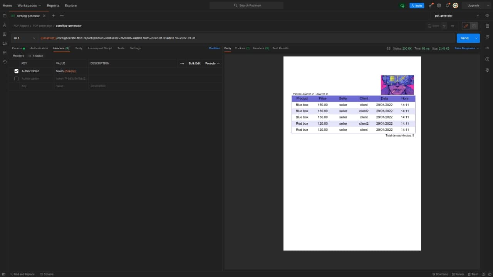

# Generating a report in PDF format with ReportLab



## How to start project.

- Create a folder in your machine
- Create a virtual environment
    - python3 -m venv venv
- Start the virtual environment
    - ```. venv/bin/activate``` (Linux)
    - ``venv/Scripts/Activate`` (Windows)
- Inside your venv folder clone the project
    - ```git clone https://github.com/alexlopesbr/<project_name>.git```
- In your-new-folder/
    - ```pip install -r requirements.txt``` to install the project's dependencies
    - ```python manage.py migrate``` to generate your database
    - ```python3 manage.py createsuperuser``` to create the admin
    - ```python3 manage.py runserver``` to start the server
- Open your browser and go to http://127.0.0.1:8000/admin/
- Login with the admin credentials
    - Now you can see you user and some info in admin panel

## Generating the report

GET ```{{localhost}}/core/generate-flow-report```

> some params:

- product:string
- seller:integer
- client:integer
- date_from:yyyy-mm-dd
- date_to:yyyy-mm-dd

>header: Must be passed the key ```Authorization``` and the value ```Token <token>```
---
> You can use [Postman](https://www.postman.com/) or [Insomnia](https://insomnia.rest/) to test the requests.<br>
> **Note:** When you start your server the localhost generaly is http://127.0.0.1:8000/.
---

> More information about ReportLab [ReportLab documentation](https://www.reportlab.com/dev/docs/)
